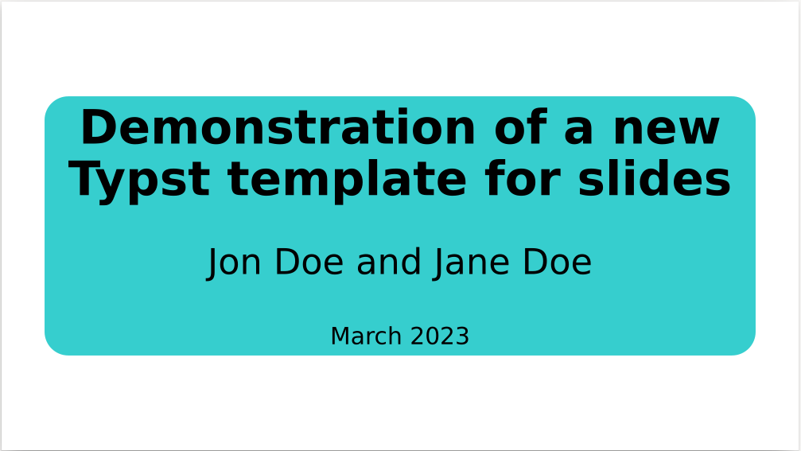
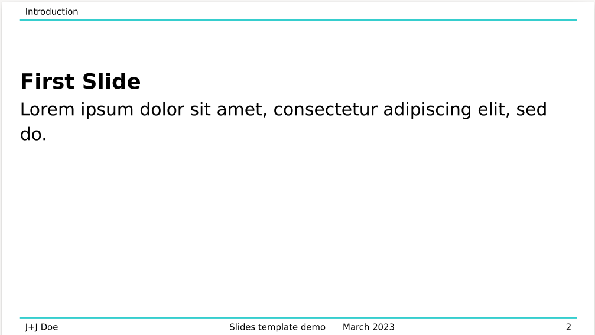
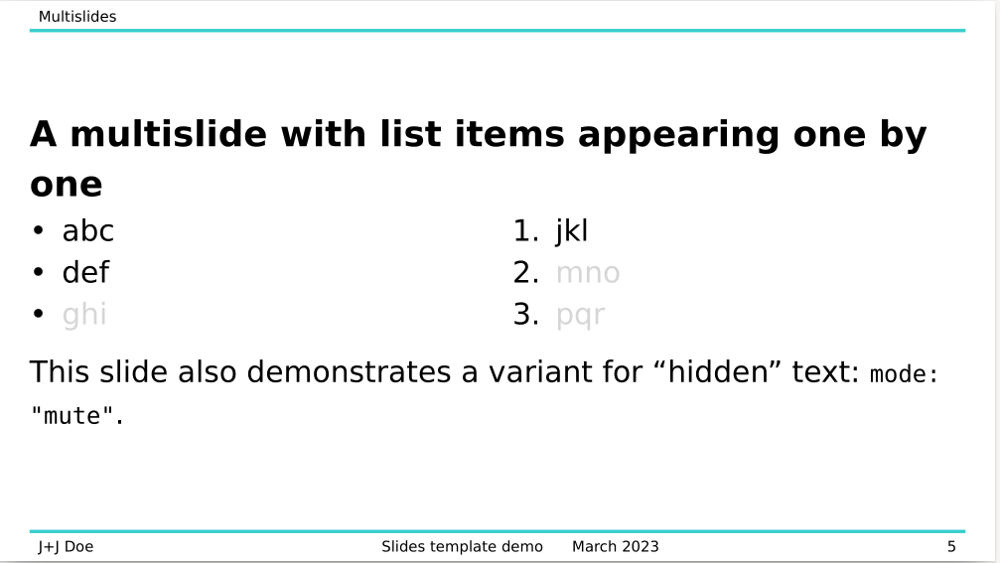

# Slides in Typst
This is a template for creating slides in [Typst](https://typst.app/).

## Quickstart
```typ
#import "slides.typ": *

#show: slides.with(
    author: "Names of author(s)",
    short-author: "Shorter version for slide footer",
    title: "Title of the presentation",
    short-title: "Shorter version for slide footer",
    date: "March 2023",
    color: teal // teal is the default value, you can use any other color
)

== A slide
Some text

== Another slide
More text

#slide[
  We do not need a special heading here.
  == But we can ...
  ... and it doesn't produce new slides here.
]

#slide[
  Another slide
]
```
As you can see, there are two ways of creating slides: using 2nd level headings
and using the `#slide` function.
So far, both options behave just the same.

That's all to get you started!
For more details and to see how you can

- display the current section in the slide header
- create dynamic slides (think _overlays_ in LaTeX beamer)

visit the [book](https://andreaskroepelin.github.io/typst-slides/)!

## Expample
An example document using this template can be found [here](examples/doc.typ).
Its output should look like this:




