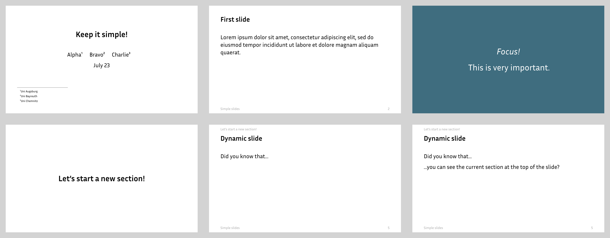

# Slides in Typst
This is a template for creating slides in [Typst](https://typst.app/).

[](https://andreaskroepelin.github.io/typst-slides/book)


## Quickstart
```typ
#import "slides.typ": *

#show: slides.with(
    author: "Names of author(s)",
    short-author: "Shorter author for slide footer",
    title: "Title of the presentation",
    short-title: "Shorter title for slide footer",
    date: "March 2023",
)

#new-section("My section name")

#slide(title: "A boring static slide")[
  Some boring static text.
]

#slide[
  A fancy dynamic slide without a title.
  More text.
  #only(2)[This appears later!]
]
```
As you can see, creating slides is as simple as using the `#slide` function.
(You do not need to care about stuff like `#new-section` or `#only` in the
beginning.)

This code produces these PDF pages:


That's all to get you started!
For more details, visit the
[book](https://andreaskroepelin.github.io/typst-slides/book)!

**⚠ This template is in active development.
While I try to make sure that the `master`-branch always is in a usable state,
there are no compatibility guarantees!**
