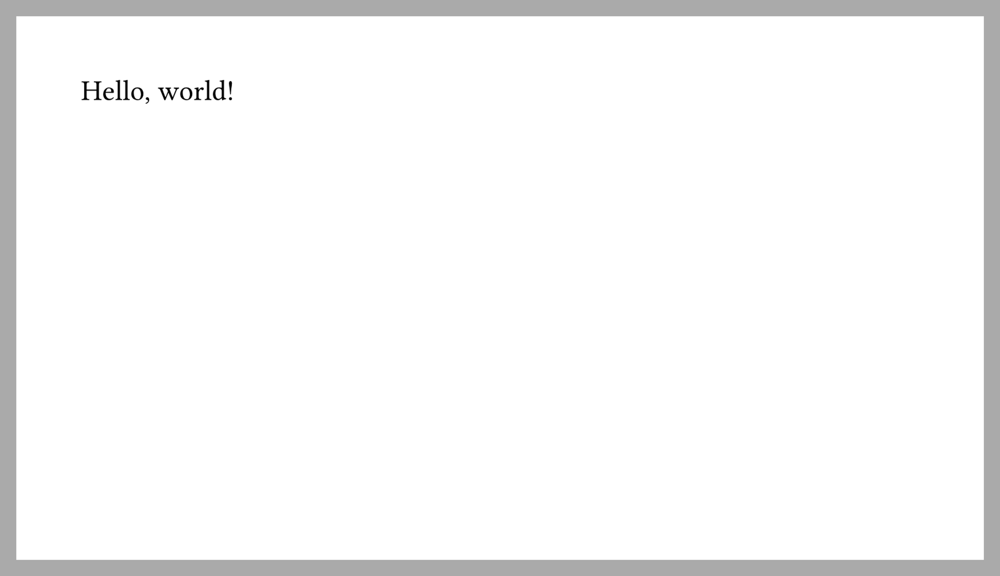
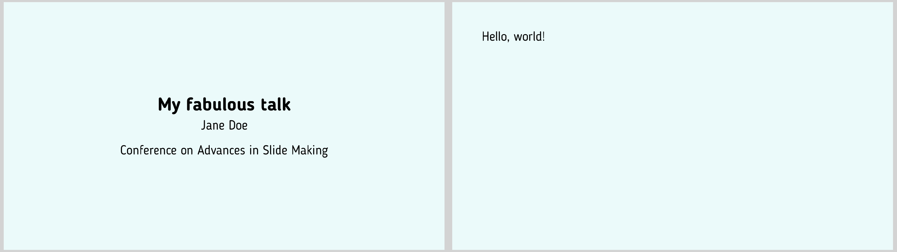
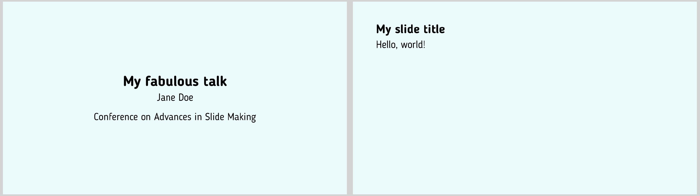
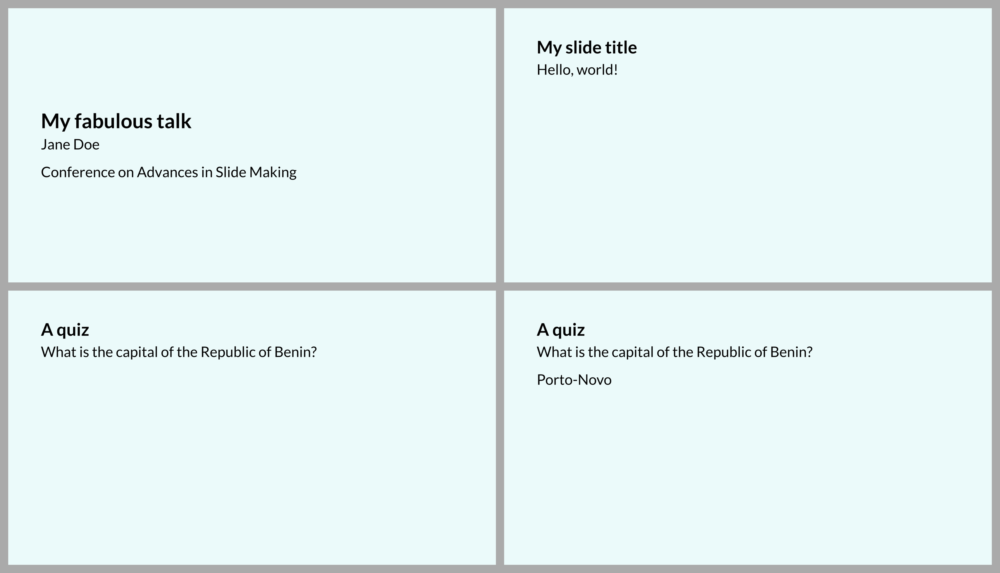

# Do it yourself

Let's start with the absolute minimal effort.
What characterises a set of slides?
Well, each slide (or PDF page, as we already established) has specific dimensions.
Some time ago, a 4:3 format was common, nowadays 16:9 is used more often.
Typst has those built in:
```typ
#set page(paper: "presentation-16-9")
```
You probably don't want your audience to carry magnifying glasses, so let's set
the font size to something readable from the last row:
```typ
#set text(size: 25pt)
```
We should be ready do go to create some actual slides now.
We will use the function `polylux-slide` for this, which is kind of at the core
of this package.
```typ
// Remember to actually import polylux before this!

#polylux-slide[
  Hello, world!
]
```
And here is the result (the gray border is not part of the output but it makes
the slide easier to see here):

Already kinda looks like a slide, but also a bit boring, maybe.
We should add a title slide before that so that our audience actually knows what
talk they are attending.
Also, let us choose a nicer font and maybe add some colour?
We modify the `#set page` and `#set text` commands for that:
```typ
#set page(paper: "presentation-16-9", fill: teal.lighten(90%))
#set text(size: 25pt, font: "Blogger Sans")

#polylux-slide[
  #set align(horizon + center)
  = My fabulous talk

  Jane Doe

  Conference on Advances in Slide Making
]
```

Not bad, right?
Another thing that is usually a good idea is to have a title on each slide.
That is also no big deal by using off-the-shelf Typst features, so let's modify
our first slide:
```typ
#polylux-slide[
  == My slide title
  Hello, world!
]
```
This is starting to look like a real presentation:


## So what?
To be honest, everything we did so far would have been just as easy without
using polylux at all.
So why should you care about it?

Consider the following situation:
You have a slide where parts of the content appear or disappear, or the colour
of some text changes, or some other small-sized change.
Would you like to duplicate the whole slide just so to create this affect?
And then maintain multiple copies of the same content, making sure never to
forget updating all copies when your content evolves?
Of course you wouldn't and, gladly, polylux can handle this for you.

This kind of feature is called **dynamic content** or **overlays** (loosely
speaking, you might also say **animations** but that might be a bit of a stretch,
nothing actually "moves" on PDF pages).

So how does that work in polylux?
As a quick example, let's add a little quiz to our slides:
```typ
#polylux-slide[
  == A quiz

  What is the capital of the Republic of Benin?

  #uncover(2)[Cotonou]
]
```

Note how two more slides have been created even though we declared only one.

The next sections will explain dynamic content in polylux in all its details.

For reference, here is the full source code for the slides we developed in this
section:
```typ
#import "@preview/polylux:0.2.0": *

#set page(paper: "presentation-16-9", fill: teal.lighten(90%))
#set text(size: 25pt, font: "Blogger Sans")

#polylux-slide[
  #set align(horizon + center)
  = My fabulous talk

  Jane Doe

  Conference on Advances in Slide Making
]

#polylux-slide[
  == My slide title
  Hello, world!
]

#polylux-slide[
  == A quiz

  What is the capital of the Republic of Benin?

  #uncover(2)[Cotonou]
]
```

