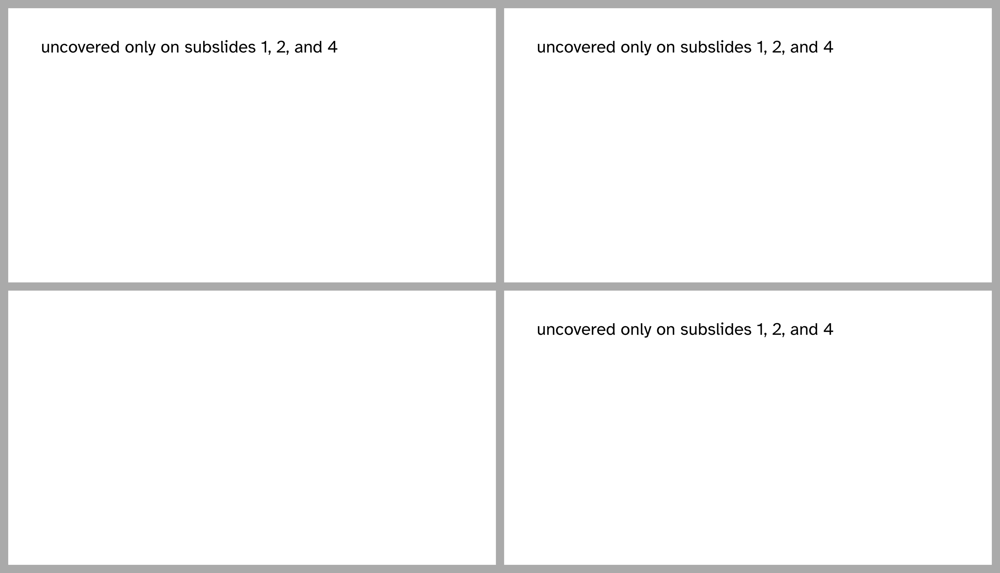
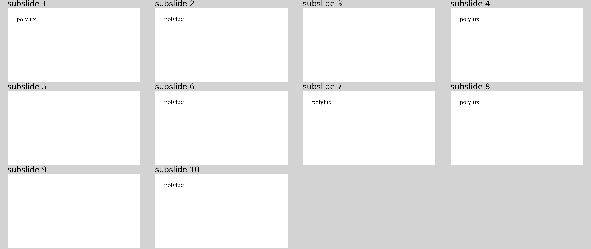

# Complex display rules
There are multiple options to define more complex display rules than a single
number.

### Array
The simplest extension is to use an array.
For example
```typ
{{#include rule-array.typ:5:}}
```
results in:



The array elements can actually themselves be any kind of rule that is explained
on this page.

### Interval
You can also provide a (bounded or half-bounded) interval in the form of a
dictionary with a `beginning` and/or an `until` key:
```typ
{{#include rule-interval.typ:5:}}
```
results in:


In the last case, you would not need to use `#only` anyways, obviously.

### Convenient syntax as strings
In principle, you can specify every rule using numbers, arrays, and intervals.
However, consider having to write
```typ
#uncover(((until: 2), 4, (beginning: 6, until: 8), (beginning: 10)))[polylux]
```
That's only fun the first time.
Therefore, we provide a convenient alternative.
You can equivalently write:
```typ
{{#include rule-string.typ:6}}
```
which results in:



Much better, right?
The spaces are optional, so just use them if you find it more readable.

Unless you are creating those function calls programmaticly, it is a good
recommendation to use the single-number syntax (`#only(1)[...]`) if that
suffices and the string syntax for any more complex use case.

