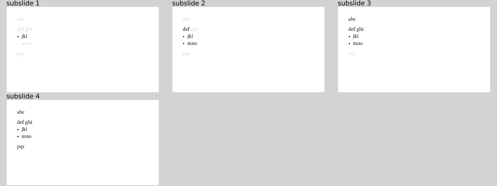

# Cover mode
Covered content (using `#uncover`, `#one-by-one`, `#line-by-line`, or `pause`)
is completely invisible, by default.
You can decide to make it visible but less prominent using the optional `mode`
argument to each of those functions.
The `mode` argument takes two different values: `"invisible"` (the default) and
`"transparent"`.
(This terminology is taken from LaTeX beamer as well.)
With `mode: "transparent"`, text is printed in a light gray.

Use it as follows:
```typ
{{#include cover.typ:6:16}}
```
resulting in



**Warning!**
The transparent mode really only wraps the covered content in a
```typ
#text(fill: gray.lighten(50%)[...]
```
so it has only limited control over the actual display.
Especially
- text that defines its own color (e.g. syntax highlighting),
- visualisations,
- images

will not be affected by that.
This makes the transparent mode only somewhat useful today.
([Relevant GitHub issue](https://github.com/andreasKroepelin/polylux/issues/17))
