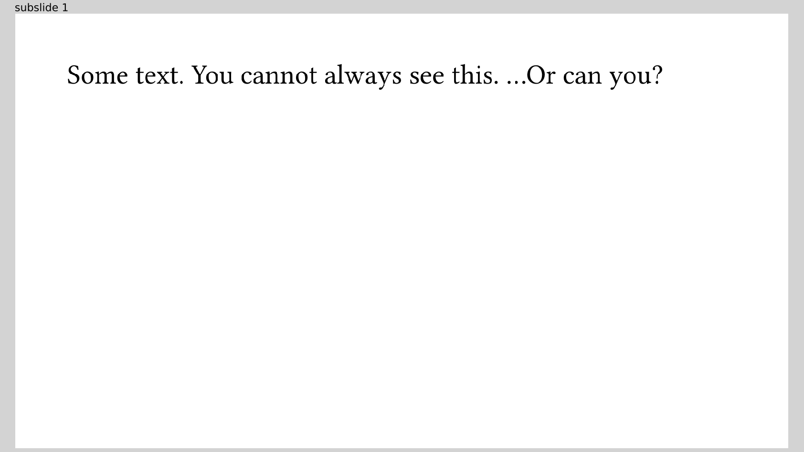

# Handout mode
If you distribute your slides after your talk for further reference, you might
not want to keep in all the dynamic content.
Imagine using `one-by-one` on a bullet point list and readers having to scroll
through endless pages when they just want to see the full list.

You can use `#enable-handout-mode(true)` at the top of your code to achieve this:

It has the effect that all dynamic visibility of elements _that reserve space_
is switched off.
For example,
```typ
{{#include handout.typ:5:11}}
```
becomes:



Note that `only` and `alternatives` are **not** affected as there is no obvious
way to unify their content to one slide.
