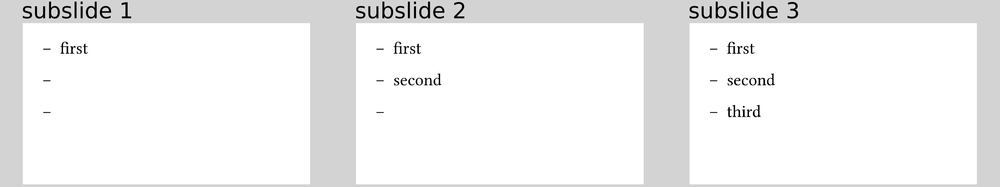

# More sophisticated piecewise revealing
## `#one-by-one`
`#pause` may be considered syntactically a bit surprising by some although (or
because) it is very convenient to use.
If you prefer to signal the grouping of content appearing together syntactically
by using scopes, you can use `#one-by-one`:
```typ
{{#include one-by-one.typ:6}}
```
resulting in


If we still want to uncover certain elements one after the other but starting
on a later subslide, we can use the optional `start` argument of `#one-by-one`:
```typ
{{#include one-by-one-start.typ:6}}
```
resulting in


This optional `start` argument exists for all functions displayed on this page.


## `#line-by-line`
`#one-by-one` is especially useful for arbitrary contents that you want to display
in that manner.
Sometimes, it produces a bit too much syntactical noise again with
all the brackets between content, though.
That is especially true if each piece fits into a single line, as for example
for a simple bullet list.
Instead of
```typ
#one-by-one[
  - first
][
  - second
][
  - third
]
```
you can also write
```typ
{{#include line-by-line.typ:6:10}}
```
resulting in


The content provided as an argument to `#line-by-line` is parsed as a `sequence`
by Typst with one element per line (hence the name of this function).
We then simply iterate over that `sequence` as if it were given to `#one-by-one`.

## `#list-one-by-one`

What if you want a more customized bullet list, though?
The code above produces a tight list, for example, and maybe you do not want that.
All your needs are covered by the `#list-one-by-one` function:
```typ
{{#include list-one-by-one.typ:6}}
```
resulting in



As you can see, you can provide any arguments that the
[`list`](https://typst.app/docs/reference/layout/list/) function accepts.

## `#enum-one-by-one`

Analogously, there is the same thing for enums, accepting the same arguments as
[`enum`](https://typst.app/docs/reference/layout/enum/):
```typ
{{#include enum-one-by-one.typ:6}}
```
resulting in


## `#terms-one-by-one`

And finally we have a function to produce a
[term list](https://typst.app/docs/reference/layout/terms/):

```typ
{{#include terms-one-by-one.typ:6}}
```
resulting in


**Note** that `#list-one-by-one` and `#enum-one-by-one` expect only the body of
the individual items while you need to provide an actual term item (using the
`/ term: description` syntax) to `#terms-one-by-one`.

Also, you will realise that the bullet markers, the numbers, and the terms in 
the lists, enums, and term lists are not hidden for technical reasons, respectively.
You can truly consider this either a bug or a feature...
(This could be "fixed" for enums and term lists, so file an issue on GitHub if
this bothers you a lot!)
