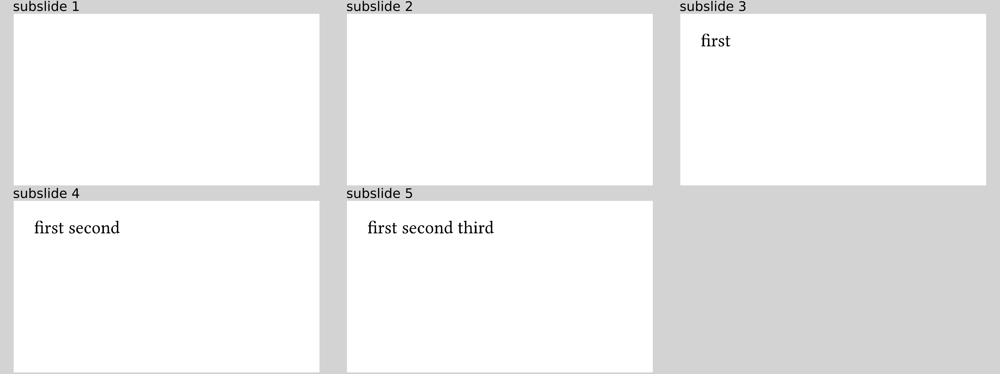
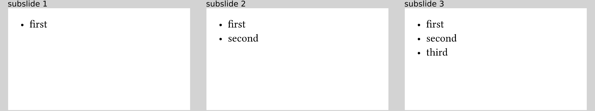

# `#one-by-one` and `#line-by-line`
Consider some code like the following:
```typ
#uncover("1-")[first ]
#uncover("2-")[second ]
#uncover("3-")[third]
```
The goal here is to uncover parts of the slide one by one, so that an increasing
amount of content is shown.
A shorter but equivalent way would be to write
```typ
{{#include one-by-one.typ:6}}
```
resulting in


And what about this?
```typ
#uncover("3-")[first ]
#uncover("4-")[second ]
#uncover("5-")[third]
```
Now, we still want to uncover certain elements one after the other but starting
on subslide 3.
We can use the optional `start` argument of `#one-by-one` for that:
```typ
{{#include one-by-one-start.typ:6}}
```
resulting in



`#one-by-one` is especially useful for arbitrary contents that you want to display
in that manner.
Often, you just want to do that with very simple elements, however.
A very frequent use case are bullet lists.
Instead of
```typ
#one-by-one[
  - first
][
  - second
][
  - third
]
```
you can also write
```typ
{{#include line-by-line.typ:6:10}}
```
resulting in



The content provided as an argument to `#line-by-line` is parsed as a `sequence`
by Typst with one element per line (hence the name of this function).
We then simply iterate over that `sequence` as if it were given to `#one-by-one`.

Note that there also is an optional `start` argument for `#line-by-line`, which
works just the same as for `#one-by-one`.

