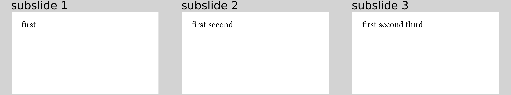

# `pause` as an alternative to `#one-by-one`
There is yet another way to solve the same problem as `#one-by-one`.
If you have used the LaTeX beamer package before, you might be familiar with the
`\pause` command.
It makes everything after it on that slide appear on the next subslide.

Remember that the concept of "do something with everything after it" is covered
by the `#show: ...` mechanism in Typst.
We exploit that to use the `pause` function in the following way.
```typ
{{#include pause.typ:6:12}}
```
This would be equivalent to:
```typ
#one-by-one[
  Show this first.
][
  Show this later.
][
  Show this even later.
][
  That took aaaages!
]
```
and results in



It is obvious that `pause` only brings an advantage over `#one-by-one` when you
want to distribute a lot of code onto different subslides.

**Hint:**
You might be annoyed by having to manually number the pauses as in the code
above.
You can diminish that issue a bit by using a counter variable:
```typ
Show this first.
#let pc = 1 // `pc` for pause counter
#{ pc += 1 } #show: pause(pc)
Show this later.
#{ pc += 1 } #show: pause(pc)
Show this even later.
#{ pc += 1 } #show: pause(pc)
That took aaaages!
```
This has the advantage that every `pause` line looks identical and you can move
them around arbitrarily.
In later versions of this template, there could be a nicer solution to this
issue, hopefully.
