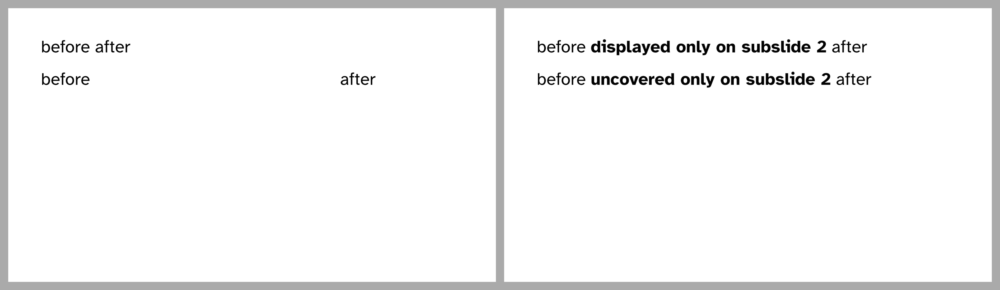

# General syntax for `#only` and `#uncover`
Both functions are used in the same way.
They each take two positional arguments, the first is a description of the
subslides the content is supposed to be shown on, the second is the content itself.
Note that Typst provides some syntactic sugar for trailing content arguments,
namely putting the content block _behind_ the function call.

You could therefore write:
```typ
{{#include only-uncover.typ:5:}}
```
...resulting in



(Note again that the gray border is not part of the slides and that the labels
indicating the index of the subslide are also added afterwards.)

You can clearly see the difference in behaviour between `only` and `uncover`.
In the first line, "after" moves but not in the second line.

In this example, we specified only a single subslide index, resulting in content
that is shown on that exact subslide and at no other one.
Let's explore more complex rules next.

