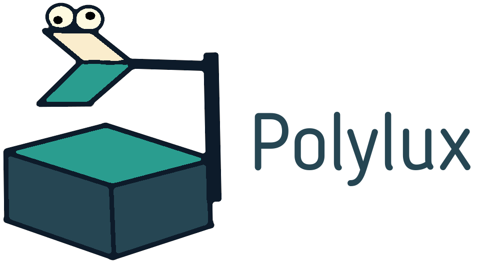

**Polylux** is a package for the typesetting system [*Typst*](https://typst.app)
to create presentation slides, just like you would use the _beamer_ package in LaTeX.
(So far, it is much less advanced than beamer, obviously.)

If you haven't heard of things like LaTeX's beamer before, here is how this works:
As a rule of thumb, one slide becomes one PDF page, and most PDF viewers can
display PDFs in the form of a slide show (usually by hitting the F5-key).

Polylux gives you:
- Elegant yet powerfull typesetting by the ever-improving Typst.
- Fully customisable slides.
- Dynamic slides (or *overlays* or (dis-)appearing content, or however you want
  to call it).
- Decently looking themes.

If you like it, consider [giving a star on GitHub](https://github.com/andreasKroepelin/polylux)!

## Why the name?
A [*polylux*](https://en.wikipedia.org/wiki/Polylux_(overhead_projector)) is
a brand of overhead projectors very common in Eastern German schools (where the
main author of this package grew up).
It fulfils a similar function to a projector, namely projecting visuals to a
wall to aid a presentation.
The German term for projector is *beamer*, and now you might understand how it
all comes together.
(The original author of the aforementioned LaTeX package is German as well.)

## Contributing
This package is free and open source.
You can find the code on [GitHub](https://github.com/andreasKroepelin/polylux)
where you can also create issues or pull requests.

## License
Polylux is released under the
[MIT license](https://github.com/andreasKroepelin/polylux/blob/main/LICENSE).
