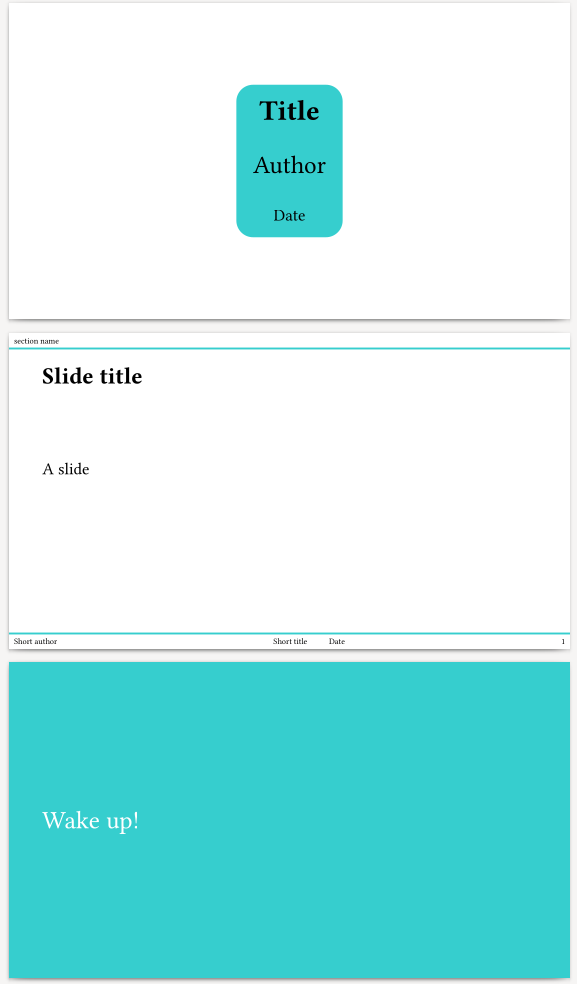
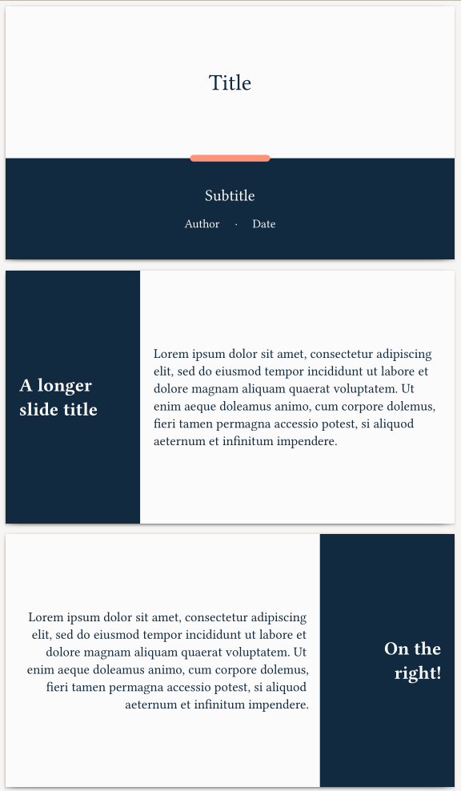
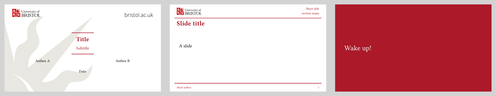

# Theme Gallery

Here you can find an overview over all themes shipped with this template.

- [Default](#default)
- [Bipartite](#bipartite)
- [UoB](#uob)

---

## Default
_[go to top](#theme-gallery)_

If you do not specify a theme, the default one will be used.
You can specify it explicitly by referring to `slides-default-theme`:
```typ
#show: slides(
  // ...
  theme: slides-default-theme(color: your-favourite-color)
)
```
### Options
- `color`: the color to use for decorative elements, default `teal`

### Variants
- `"wake up"`: no decoration, colored background, enlarged text

### Extra keyword arguments
- `title`: a title for that slide

### Showcase
```typ
#import "slides.typ": *

#show: slides.with(
    authors: ("Author A", "Author B"), short-authors: "Short author",
    title: "Title", short-title: "Short title", subtitle: "Subtitle",
    date: "Date",
)

#new-section("section name")

#slide(title: "Slide title")[
  A slide
]

#slide(theme-variant: "wake up")[
  Wake up!
]
```


---

## Bipartite
_[go to top](#theme-gallery)_

This theme is inspired by
[Modern Annual Report](https://slidesgo.com/theme/modern-annual-report).
It features a dominant partition of space into a bright and a dark side.
```typ
#import "themes/bipartite.typ": *
#show: slides(
  // ...
  theme: bipartite-theme(),
)
```
### Options
- *none*

### Variants
- `"east"`: same as default variant, but dark side on the right, text is right
  aligned
- `"center split"`: bright left and dark right half of equal size, requires two
  content bodies, one for each half (does not display a slide title)

### Extra keyword arguments
- `title`: a title for that slide

### Showcase
```typ
#import "slides.typ": *
#import "themes/bipartite.typ": *

#show: slides.with(
    authors: ("Author A", "Author B"), short-authors: "Short author",
    title: "Title", short-title: "Short title", subtitle: "Subtitle",
    date: "Date",
    theme: bipartite-theme(),
)

#new-section("section name")

#slide(title: "A longer slide title")[
  #lorem(40)
]

#slide(theme-variant: "east", title: "On the right!")[
  #lorem(40)
]

#slide(theme-variant: "center split")[
  #lorem(40)
][
  #lorem(40)
]
```



## UoB
_[go to top](#theme-gallery)_

This is a variation of the default theme, to feature academic branding. It is inspired by an old version of David Barton's
[Beamer theme](https://github.com/dawbarton/UoB-beamer-theme).
It features a University of Bristol branding by default, however the logos and colour choices can easily be swapped, to tailor the theme to any institution of your choice.
```typ
#import "themes/bipartite.typ": *
#show: slides(
  // ...
  theme: uob-theme(),
)
```

### Options
- `color`: the colour to use for decorative elements, default University of Bristol red
- `watermark`: file path for a watermark image to span the title slide, default "watermark.svg"
- `logo`: file path for a logo image to appear on every slide, default "logo.svg"
- `secondlogo`: file path for an additional logo image, to appear on the first slide only, default "secondlogo.svg"

### Variants
- `"wake up"`: no decoration, colored background, enlarged text

### Extra keyword arguments
- `title`: a title for that slide
- `colwidths` : array specifying width of each column; default `1fr` per column

### Showcase
```typ
#import "../../../slides.typ": *
#import "../../../themes/uob/uob.typ": *

#show: slides.with(
    authors: ("Author A", "Author B"), short-authors: "Short author",
    title: "Title", short-title: "Short title", subtitle: "Subtitle",
    date: "Date",
    theme: uob-theme(),
)

#new-section("section name")

#slide(title: "Slide title")[
  A slide
]

#slide(title: "Two column")[
Column A goes on the left...
][
And column B goes on the right!
]

#slide(title: "Variable column sizes", colwidths: (2fr, 1fr, 3fr))[
This is a medium-width column
][
This is a rather narrow column
][
This is a quite a wide column
]

#slide(theme-variant: "wake up")[
  Wake up!
]
```


---
