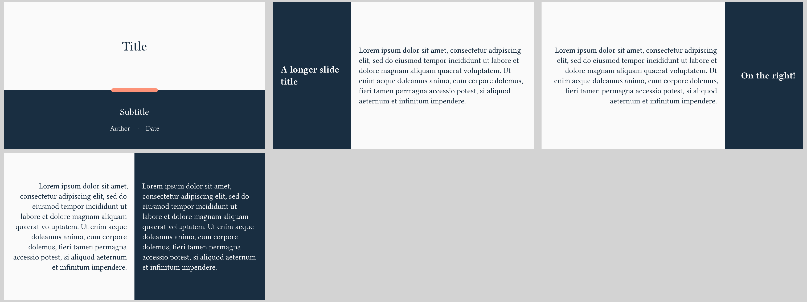

# Bipartite theme



This theme is inspired by
[Modern Annual Report](https://slidesgo.com/theme/modern-annual-report).
and a bit more opinionated.
It features a dominant partition of space into a bright and a dark side and is
rather on the "artsy" than functional side.

Use it via
```typ
#import "@preview/polylux:0.2.0": *
#import themes.bipartite: *

#show: bipartite-theme.with(...)
```

The `bipartite` theme cannot display content that exceeds one page, in general.
Note that, against the convention, `bipartite` offers no `#slide` function.
Use either `#west-slide` or #`east-slide` for regular content.
Also, this theme features no sections or slide numbers.

## Options for initialisation
`bipartite-theme` accepts the following optional keyword arguments:

- `aspect-ratio`: the aspect ratio of the slides, either `"16-9"` or `"4-3"`,
  default is `"16-9"`

## Slide functions
`bipartite` provides the following custom slide functions:

```typ
#title-slide(...)
```
Displays presentation title on a large bright portion above the subtitle, the
author and the date.
If a date was given, separates it from the author by a central dot.
Accepts the following keyword arguments:
- `title`: title of the presentation, default: `[]`
- `subtitle`: subtitle of the presentation, default: `none`
- `author`: author of presentation, arbitrary content, default: `[]`
- `date`: date of the presentation, default: `none`

Does not accept additional content.

---

```typ
#west-slide(title: ...)[
  ...
]
```
Splits the slide into a larger bright section on the right where the content
goes and a smaller, darker, left section where the title is displayed.
Everything is left aligned.

---

```typ
#east-slide(title: ...)[
  ...
]
```
Same as `#west-slide` but with the title and the content switching places, and
everything being right aligned.

---

```typ
#split-slide[
  ...
][
  ...
]
```
Splits the slide into two equal sections on the left and the right that both
contain content (`#split-slide` requires exactly two content blocks to be passed).
The left half is dark text on a bright background and right aligned, the right
half is bright text on dark background and left aligned.
Does not display a slide title.


## Example code
The image at the top is created by the following code:
```typ
#import "@preview/polylux:0.2.0": *
{{#include bipartite.typ:3:}}
```
