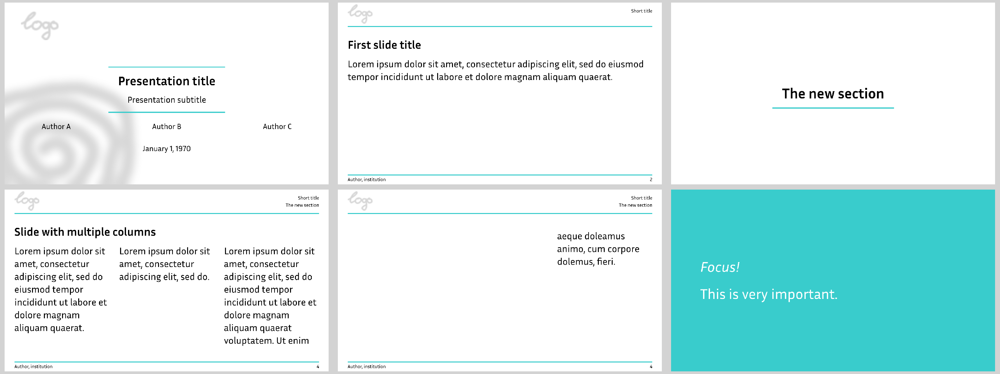

# Clean theme



This theme is a bit more opinionated than the `simple` theme but still supposed
to be an off-the-shelf solution that fits many use cases.

Use it via
```typ
#import "@preview/polylux:0.2.0": *
#import themes.clean: *

#show: clean-theme.with(...)
```

`clean` uses polylux' section handling, the regular `#outline()` will not work
properly, use `#polylux-outline()` instead.

Text is configured to have a base font size of 25 pt.

## Options for initialisation
`clean-theme` accepts the following optional keyword arguments:

- `aspect-ratio`: the aspect ratio of the slides, either `"16-9"` or `"4-3"`,
  default is `"16-9"`
- `footer`: text to display in the footer of every slide, default is `[]`
- `short-title`: short form of the presentation title, to be displayed on every
  slide, default: `none`
- `logo`: some content (most likely an image) used as a logo on every slide,
  default: `none`
- `color`: colour of decorative lines, default: `teal`

## Slide functions
`clean` provides the following custom slide functions:

```typ
#title-slide(...)
```
Creates a title slide where title and subtitle are put between decorative lines,
along with logos and author and date infos.
Accepts the following keyword arguments:
- `title`: title of the presentation, default: `none`
- `subtitle`: subtitle of the presentation, default: `none`
- `authors`: authors of presentation, can be an array of contents or a single
  content, will be displayed in a grid, default: `()`
- `date`: date of the presentation, default: `none`
- `watermark`: some content (most likely an image) used as a watermark behind
  the titlepage, default: `none`
- `secondlogo`: some content (most likely an image) used as a second logo opposite
  to the regular logo on the title page, default: `none`

Does not accept additional content.

---

```typ
#slide(...)[
  ...
][
  ...
]
```
Decorates the provided content with a header containing the current section (if
any), the short title of the presentation, and the logo; and a footer containing
some custom text and the slide number.

Accepts an arbitrary amount of content blocks, they are placed next to each other
as columns.
Configure using the `columns` and `gutter` keyword arguments. 

Pass the slide title as a keyword argument `title`.

Accepts the following keyword arguments:
- `title`: title of the slide, default: `none`,
- `columns`: propagated to `grid` for placing the body columns, default: array
  filled with as many `1fr` as there are content blocks
- `gutter`: propagated to `grid` for placing the body columns, default: `1em`

---

```typ
#focus-slide(foreground: ..., background: ...)[
  ...
]
```
Draw attention with this variant where the content is displayed centered and text
is enlarged.
Optionally accepts a foreground colour (default: `white`) and background color
(default: `teal`).
Not suitable for content that exceeds one page.

---

```typ
#new-section-slide(name)
```
Start a new section with the given `name` (string or content, positional argument).
Creates a slide with this name in the center, a decorative line below, and
nothing else.
Use `#polylux-outline()` to display all sections, similarly to how you would use
`#outline()` otherwise.


## Example code
The image at the top is created by the following code:
```typ
#import "@preview/polylux:0.2.0": *
{{#include clean.typ:3:}}
```
