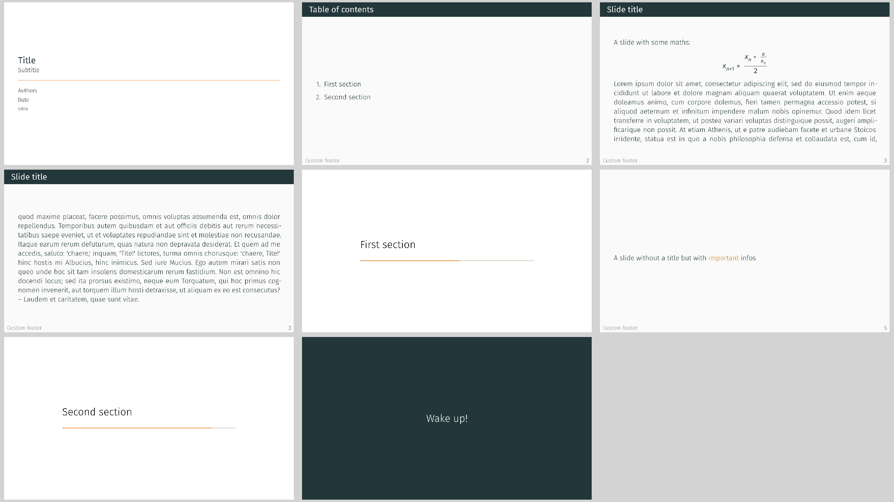

# Metropolis theme



This theme is inspired by the
[Metropolis beamer theme](https://github.com/matze/mtheme),
created by Matthias Vogelgesang.

Use it via
```typ
#import "@preview/polylux:0.2.0": *
#import themes.metropolis: *

#show: metropolis-theme.with(...)
```

`metropolis` uses polylux' section handling, the regular `#outline()` will not work
properly, use `#metropolis-outline` instead.

## Options for initialisation
`metropolis-theme` accepts the following optional keyword arguments:

- `aspect-ratio`: the aspect ratio of the slides, either `"16-9"` or `"4-3"`,
  default is `"16-9"`
- `footer`: text to display in the footer of every slide, default is `[]`

## Slide functions
`metropolis` provides the following custom slide functions:

```typ
#title-slide(...)
```
Creates a title slide where title and subtitle are separated by additional
information by a bright line.
Accepts the following keyword arguments:
- `title`: title of the presentation, default: `[]`
- `subtitle`: subtitle of the presentation, default: `none`
- `author`: author of presentation, can be arbitrary contet, default: `none`
- `date`: date of the presentation, default: `none`
- `extra`: some extra information, can be used for affiliation, instiution,
  logos, etc., default: `none`

Does not accept additional content.

---

```typ
#slide(...)[
  ...
]
```
Decorates the provided content with a header containing the slide title and a
footer containing some custom text and the slide number.

Pass the slide title as a keyword argument `title` (default: `none`).

---

```typ
#focus-slide[
  ...
]
```
Draw attention with this variant where the content is displayed centered and text
is enlarged and bright.
Uses the background colour of the title on regular slides as the background
colour for the whole slide.
Not suitable for content that exceeds one page.

---

```typ
#new-section-slide(name)
```
Start a new section with the given `name` (string or content, positional argument).
Creates a slide with this name in the center, a progress bar indicating the
current progress of the presentation below, and nothing else.
Use `#metropolis-outline` to display all sections, similarly to how you would use
`#outline()` otherwise.

## Additional features
`metropolis` provides a further way to highlight text besids `#emph` and `#strong`,
namely `#alert` (as known from LaTex's beamer).
```typ
#alert[very important]
```
prints its content in a bright colour.

There is also `#metropolis-outline` which customises `#polylux-outline` and
displays a table of contents with all sections.


## Example code
The image at the top is created by the following code:
```typ
#import "@preview/polylux:0.2.0": *
{{#include metropolis.typ:3:}}
```
