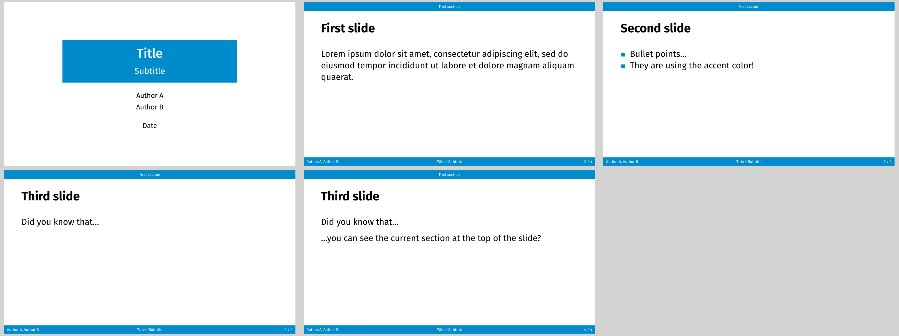

# Rectangles theme



This theme is inspired by the LaTeX beamer outer theme "miniframes" and inner theme "rectangles". It is similar to the `university` theme. but designed to be easier to use at the cost of customizability.

Use it via
```typ
{{#include ../../IMPORT.typ}}
#import themes.rectangles: *

#show: rectangles-theme.with(...)
```

`rectangles` uses polylux' section handling, the regular `#outline()` will not work
properly, use `#polylux-outline` instead.
Starting a new section is done via the `#new-section()` function.

Text is configured to have a base font size of 25 pt.

## Options for initialisation
`rectangles-theme` accepts the following optional keyword arguments:

- `aspect-ratio`: the aspect ratio of the slides, either `"16-9"` or `"4-3"`,
  default is `"16-9"`
- `title`: title of the presentation, default: `none`
- `subtitle`: subtitle of the presentation, default: `none`
- `authors`: authors of presentation, can be an array of contents or a single content, default: `none`
- `date`: date of the presentation, default: `none`
- `short-title`: short title of the presentation to display in the footer of each slide, default: `none`, falls back to `title + [ – ] + subtitle` if `subtitle` was given and `title` otherwise
- `short-authors`: short authors of the presentation to display in the footer of each slide, default: `none`, falls back to `authors.join(", ")`
- `accent-fill-color`: fill color of the decorations, default: `rgb("#008ccc")`
- `accent-text-color`: text color of the decorations, default: `white`

## Slide functions
`rectangles` provides the following custom slide functions:

```typ
#title-slide()
```
Creates a title slide where title and subtitle are displayed in a solid box and the authors and date are displayed below.

Does not accept arguments or additional content.

---

```typ
#slide(...)[
  ...
]
```
Decorates the provided content with a header containing the current section (if any) and a footer containing the short authors, short presentation title, and the slide number.

## Example code
The image at the top is created by the following code:
```typ
{{#include ../../IMPORT.typ}}
{{#include rectangles.typ:3:}}
```
