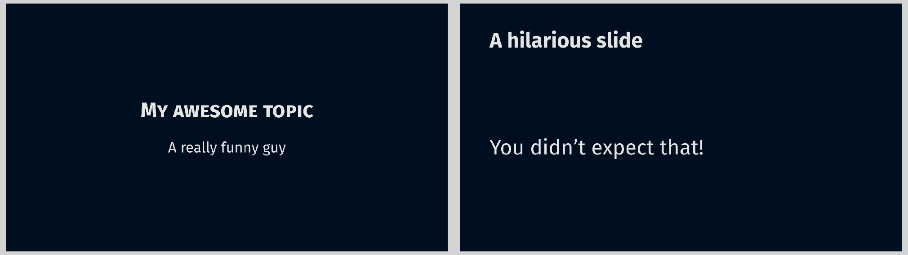

# Build your own theme

Again, there is no right or wrong when it comes to how a polylux theme works.
If you consider building a theme that you would like to contribute to the
package ([which you are cordially invited to do!](https://github.com/andreasKroepelin/polylux/pulls)),
we kindly ask you to follow the convention presented before.
In any case, it is probably a good idea to take that as an orientation.

To demonstrate how one would go about defining a custom theme, let us create one
together!
How about we make one for science slams?
If you have ever been to one, you might have noticed that the presenters there
love sparse dark-mode slides with huge font sizes.

## Imports
Depending on whether this is a theme for yourself or supposed to be part of
polylux, you do one of two things:
For yourself, you simply import polylux as always:
```typ
#import "@preview/polylux:0.2.0": *
```

A theme that is shipped with polylux doesn't have to do that, and it shouldn't!
Otherwise circular imports can occur.
Instead, you depend on the two files `logic.typ` and `helpers.typ`.
As your theme file `science-slam.typ` will be inside the `themes` directory, the
imports will be:
```typ
#import "../logic.typ"
#import "../helpers.typ"
```
Additionally, you have to make polylux know about your theme which you do by
adding
```typ
#import "science-slam.typ"
```
to `themes/themes.typ`.

## The initialisation function

With that out of the way, we start with the function that sets the scene for
everything else to come.
By convention, we call it `science-slam-theme` and it can accept some keyword
arguments along a single content argument.
The keyword arguments are for configuration options, the content is for the rest
of the document (read [here](https://typst.app/docs/tutorial/making-a-template/)
if you are unfamiliar with this kind of function, this feature is rather unique
to Typst).
```typ
{{#include science-slam.typ:init}}
```
As you can see, we have two configuration options:
One for the aspect ratio (as is convention) and one to determine the background
colour — the more serious you are, the darker your background colour is, of course.
After we have set the `page` parameters accordingly, we also define the text to
be huge, bright and in a sans serif font.

Using it looks like this:
```typ
{{#include science-slam.typ:use-init}}
```

## Title slide
Next up, let us define a cool title slide.
The only thing you have to keep in mind when defining your own slide functions
is that **you need to put the content you produce into the `#polylux-slide`
function in the end**.
It might look as if it works without that as well but it actually breaks when you
use `#uncover` or similar polylux features.
If you build a theme as part of polylux and you have followed the import
instructions from above, you will qualify the function as `logic.polylux-slide`.

Our title slide here is very simple, it just makes very sure to let the audience
know what the topic is and who is speaking:
```typ
{{#include science-slam.typ:title-slide}}
```
You can use it like this:
```typ
{{#include science-slam.typ:use-title-slide}}
```

Note that the user does not actually provide any content themselves to this function.
That is a common thing for title slides because their structure is so well-defined
that a theme can produce all the content by just asking for a few pieces of
information (like the title etc.).

## Regular slides
The principle is the same as with the title slide.
Define a function, create some content, pass it to `polylux-slide`.
By convention, you should name the function for regular slides `slide` because
it will be used most often.
Here you will typically accept arbitrary content as a positional parameter that
will make up the main content of the slide.

For example:
```typ
{{#include science-slam.typ:slide}}
```
And you can use it like this:
```typ
{{#include science-slam.typ:use-slide}}
```

In case you wondered, this is how the theme and the slides we just put together
look like:



## Any number of further variants
Be creative!
There are no limits but your own to the slide functions your theme can contain
once you grasped the simple structure.
For "serious" themes (other than this demo) you will probably want to think
about adding headers, footers, slide numbers etc.
Why not look into the source code of existing themes to get some inspiration?

The next page also lists some small tools that polylux provides to make common
tasks simpler when creating a slide.
