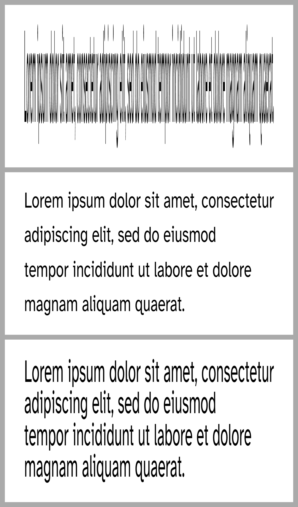

# Scaling big

Use the function `#toolbox.big` to scale some content such that it fills the
available width and height on a slide.
In particular, it will fill the height `1fr`.
Keep this in mind when using other elements of fractional height, such as
`v(1fr)`.

```typ
{{#include big.typ:6}}
```


How well this works depends on the content you want to scale.
Note that the scaling is not proportional so the content might get distorted.
Insert linebreaks to adjust how the result looks.

In this more complex example, we have the same text scaled by `big` three times
but we succesively adjust it using linebreaks and the leading height.

```typ
{{#include big-complex.typ:5:25}}
```


