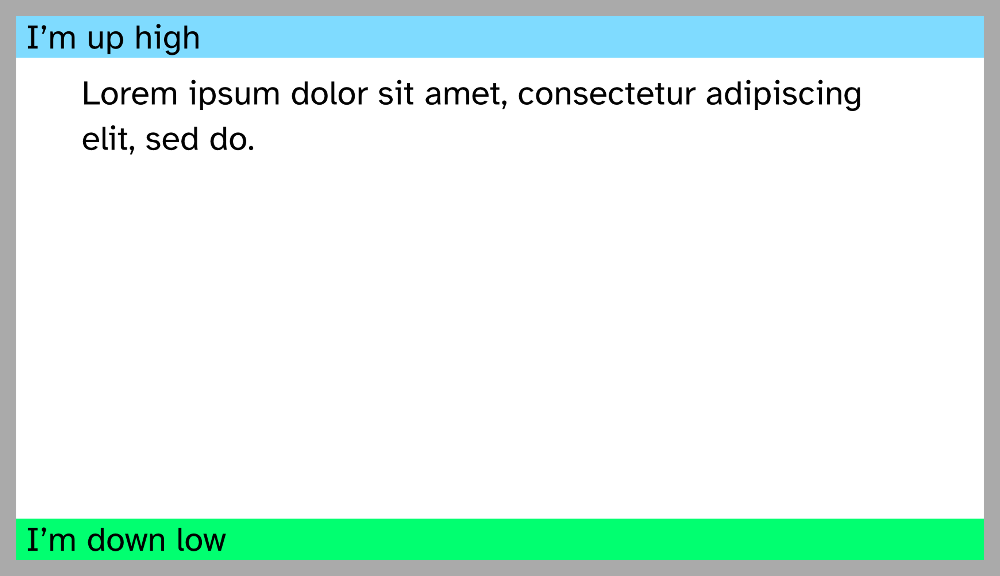

# Full width block

Sometimes you want content that spans the whole physical width of your slide,
disregarding the page margin.
This can be achieved using some annoying calculatings involving `page.margin`
which are luckily already done for you if you use `#toolbox.full-width-block`!

**Note** that this only works when the left and right page margin are explicitly
specified (i.e. both are neither `none` nor `auto`).

This can be very useful for headers and footers.

```typ
{{#include full-width.typ:4:13}}
```

