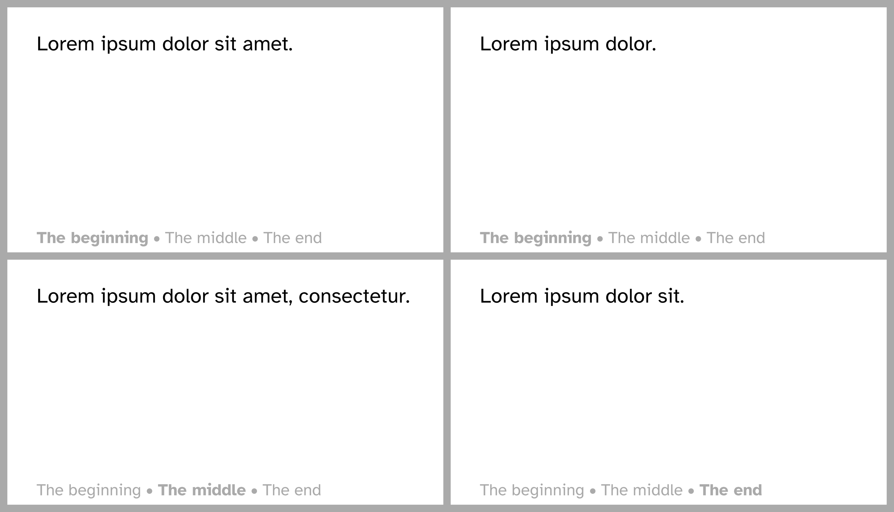

# Sections
Another way of expressing where we are in a presentation is working with sections.

In your presentation, you can incorporate the following features from the
`toolbox` module:

First, whenever you want to start a new section, you can call
```typ
#toolbox.register-section(the-section-name)
```
with whatever name you want.

Based on that, you can then display what section the presenter is currently in
by using:
```typ
#toolbox.current-section
```
If no section has been registered so far, this is empty content (`[]`).

And finally, you might want to display some kind of overview over all the
sections.
This is achieved by:
```typ
#toolbox.all-sections((sections, current) => [some content])
```
`all-sections` takes a function with two arguments and uses that to produce
some content based on all sections in the presentation and the current one.

For example:
```typ
{{#include sections-band.typ:5:35}}
```



Another example, producing a table of contents and title slides for each new
section:
```typ
{{#include sections.typ:5:39}}
```

