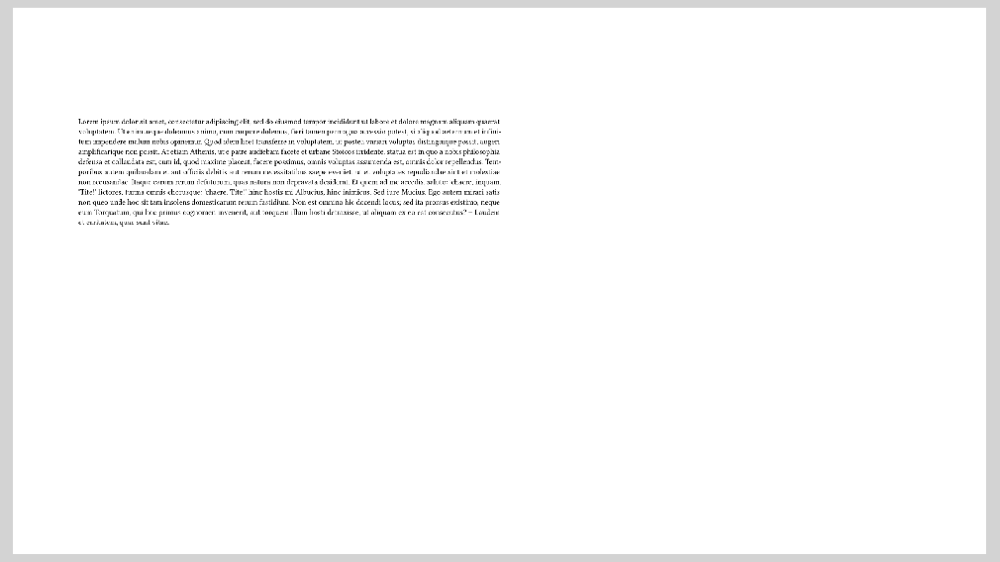

# Fit to height

Suppose you have some content and some size constraints for it but the two don't
match, i.e. the content does not have the size that you want.
The function `#fit-to-height` can help you with that.

It expects a height and some content and will try to scale the content such that
it takes on the given height:

```typ
{{#include fill-remaining.typ:6}}
```

resulting in


Using `1fr` as the height is probably also the prime use case for this function,
as it fills the remaining space of the slide with the given content.
Anything else (like `5pt`, `3cm`, `4em` etc.) is possible as well, of course.

## Adjusting the width
To finetune the result of `#fit-to-height`, you have two optional parameters:
- `width`: If specified, this determines the width of the content _after_ scaling.
  So, if you want the scaled content to fill half the slide's width for example,
  you can use `width: 50%`.
  By default, the scaled content will be constrained by the slide's width and
  will have less than the requested height if necessary.
- `prescale-width`: This parameter allows you to make Typst's layouting assume
  the given content is to be layouted in a container of a certain width _before_
  scaling.
  You can pretend the slide is twice as wide using `prescale-width: 200%`, for
  example.

We can illustrate that using the following example:

```typ
{{#include fit-to-height-width.typ:6:9}}
```

resulting in


